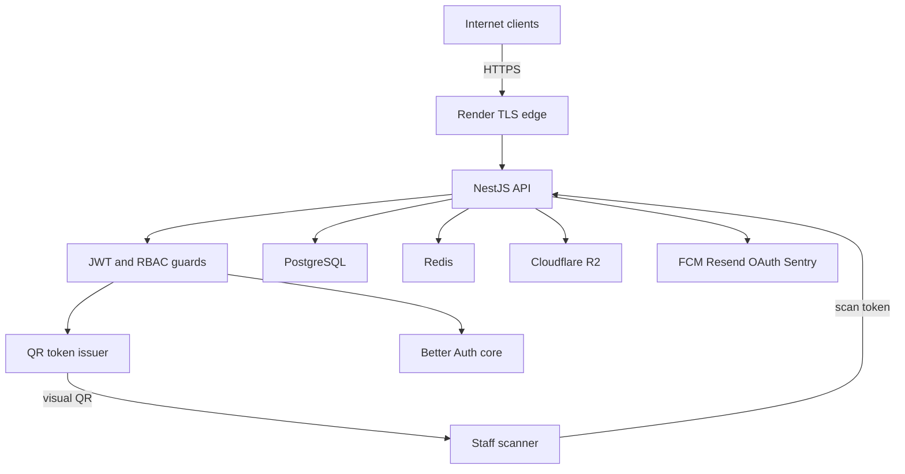

# sacdia-backend threat model

**Date**: 2026-08-23  
**Repo**: `/Users/abner/Documents/development/sacdia/sacdia-backend`  
**Branch**: `fix/qr-card-identity-section` @ `e7e9d11`  
**Companion report**: `security_best_practices_report.md`  
**User context**: not yet confirmed — rankings use the assumptions below  
**Out of scope**: `sacdia-admin` UI, Flutter app, Neon/R2/Render operator consoles, tests as attack surface (except e2e passthrough flags)

## Executive summary

SACDIA backend is an internet-facing NestJS API for Pathfinder/Adventurer club administration. It holds member PII, health data, emergency contacts, payment proofs, and evidence files. The perimeter is deny-by-default JWT + fail-closed RBAC, with Redis rate limits and private R2 objects behind short-lived signed URLs.

The dominant abuse path is **confused-deputy use of the member QR JWT as an API access token** (same HS256 secret, no `aud` check). A QR designed to be shown to staff becomes a 24h account session, including owner-bypass medical routes and GDPR export. Second is **authenticated directory enumeration** (`GET /clubs` and `GET /clubs/:id/sections`) that does not implement the territorial crop claimed in the security guide. Follow-up passes add **club `role_id` category skip** (permission elevation on club-scoped routes), a **missing password-reset confirm** API, **OAuth without auth-grade throttle**, and **MIME-only / 500 MB presign** upload gaps. Residual risk includes proxy/IP throttling assumptions on Render.

## Scope and assumptions

**In-scope paths**: `src/`, `prisma/schema.prisma`, `src/config/`, `.github/workflows/ci.yml`, `render.yaml`, `.env.example`

**Out of scope**: admin Next.js and Flutter clients; production secret values; edge WAF (not in repo); the private admin-session branch described in `docs/api/SECURITY-GUIDE.md` (not present on this branch)

**Assumptions that change ranking** (pending confirmation):

1. Production is the Render web service in `render.yaml` (`NODE_ENV=production`, public HTTPS, health `/api/v1/health`).
2. Clients (admin + mobile) send API auth as `Authorization: Bearer` only — not as cookies — so browser CSRF is out of scope for current runtime.
3. TLS terminates at Render; the Node process sees HTTP behind one trusted hop (`trust proxy = 1`).
4. Data is multi-tenant by church/club/local-field/union; a member of club A must not read club B operations or another field’s PII.
5. `GET /clubs` worldwide listing for any JWT is **not** the intended contract for territorial directors (SECURITY-GUIDE says crop). If product wants a worldwide picker, TM-002 drops to medium/accepted.
6. QR cards are shown to other people (staff, printed PDF) as part of normal use.

**Open questions** (material):

- Confirm assumption 2 (Bearer vs cookie) and 5 (clubs list contract).
- Confirm Render proxy hop count / `X-Forwarded-For` overwrite.

## System model

### Primary components

| Component | Role | Evidence |
| --- | --- | --- |
| NestJS HTTP API | `/api/v1/*` on Express, listen `0.0.0.0` | `src/main.ts:303-311,376-377` |
| GlobalJwtAuthGuard + PermissionsGuard | Deny-by-default authn/authz | `src/app.module.ts:269-286` |
| BetterAuthService | Password/OAuth/session + Option C HS256 JWT | `src/better-auth/better-auth.service.ts`, `better-auth.config.ts` |
| JwtStrategy | Bearer verify + blacklist | `src/auth/strategies/jwt.strategy.ts` |
| QrService | Member QR JWT + card/PDF + scan | `src/qr/` |
| Prisma + Neon PostgreSQL | System of record (PII, RBAC, finances, evidence metadata) | `prisma/schema.prisma`, `DATABASE_URL` |
| Redis | Cache, throttle storage, BullMQ | `src/config/cache.config.ts`, `throttler.config.ts` |
| BullMQ workers | Email, FCM, rankings, monthly PDF, exports | `src/background-jobs/`, `src/notifications/` |
| Cloudflare R2 | Private objects + short signed URLs | `env.validation.ts` R2_* |
| Firebase FCM | Push + silent cache invalidate | `src/notifications/` |
| Resend | Transactional email (fail-closed if `EMAIL_ENABLED`≠true) | `better-auth.service.ts:507-510` |
| Sentry | Error telemetry with redaction | `src/main.ts:49-125` |
| Render | Build, `prisma migrate deploy`, process | `render.yaml` |

CI/dev only: GitHub Actions (`ci.yml`), Jest e2e `E2E_PASSTHROUGH_PERMISSIONS` (blocked when `NODE_ENV=production`).

### Data flows and trust boundaries

- **Internet → API** — HTTPS (edge). JSON / multipart / query. CORS allowlist + credentials; no-Origin allowed (mobile). JWT or `@Public()`. Rate limit (Redis). Schema: `I18nValidationPipe` whitelist + `SanitizePipe`.
- **Browser/app → OAuth provider → BA callback → client → `POST /auth/oauth/callback`** — authorization code at BA; client posts opaque session token; SACDIA issues JWT. Redirect URL allowlisted in `OAuthService`.
- **API → PostgreSQL** — Prisma (parameterized). Trust: DB credentials in env. App enforces tenant scope in guards/services.
- **API → Redis** — cache keys, throttle counters, queues. Prod fail-fast if missing.
- **API → R2** — server-generated keys; client gets presigned PUT/GET. MIME/size checked on confirm for certifications/payment proofs.
- **API → FCM / Resend / Sentry / Google / Apple** — operator-configured secrets. Outbound URLs for avatars/PDFs are server-minted signed URLs, not raw user URLs.
- **Member QR display → scanner device → `POST /qr/validate`** — QR JWT crosses a **physical/social** boundary. Scan path checks `aud`; API JWT path does not.

#### Diagram

## Assets and security objectives

| Asset | Why it matters | Security objective (C/I/A) |
| --- | --- | --- |
| Member PII (name, email, phone, address, birthday) | Identity theft, stalking, church-directory abuse | C |
| Health + emergency contacts + blood type | Medical confidentiality; printed on QR card | C |
| Legal representative (minors) | Child-related PII | C |
| Club finances, payment proofs, insurance | Fraud, financial PII | C / I |
| Evidence files, monthly report PDFs, GDPR export packages | Sensitive documents; export is full account dump | C |
| JWT signing key `BETTER_AUTH_SECRET` | Forges any user session + QR | C / I |
| Opaque BA session / refresh token (7d) | Long-lived replay | C |
| RBAC grants and territorial scope | Integrity of multi-tenant isolation | I |
| Bootstrap secret | Creates first super-admin | C / I |
| R2 access keys | Bulk document exfil | C |
| Audit logs | Detection and accountability | I |
| Redis + BullMQ | Availability of API, email, rankings | A |
| FCM tokens | Spam / account-notify abuse | I / A |

## Attacker model

### Capabilities

- Unauthenticated internet client: hit `@Public()` (health, auth, catalogs, honors/classes/cert browse, OAuth, bootstrap).
- Authenticated member: JWT after register/login/OAuth; can call SkipPermissions self-service and owner-bypass `user` routes.
- Club staff with `qr:validate` / `attendance:manage`: receive QR strings as part of duty.
- Territorial director (LF/union/DIA): broader list/mutate within (documented) scope.
- Global admin / super-admin: wildcard permissions; health details; catalog mutation.
- Stolen QR photograph or PDF (expected in the product’s physical flow).
- Stolen device with Bearer token in app storage (client-side; not modeled as backend bug).

### Non-capabilities (unless separately in scope)

- No assumed access to Render/Neon/Redis dashboards or `.env`.
- No assumed RCE via template engines (API is JSON, no `res.render` of user templates).
- No assumed ability to set `E2E_PASSTHROUGH_PERMISSIONS` in production (`permissions.guard.ts:74-78`).
- No Node inspector in `start:prod`.
- Clients cannot choose R2 object keys on certification/payment-proof flows (server-generated).

## Entry points and attack surfaces

| Surface | How reached | Trust boundary | Notes | Evidence |
| --- | --- | --- | --- | --- |
| `GET /api/v1/health` | Unauth | Internet → API | Liveness only | `health.controller.ts:26-42` |
| `POST /auth/{register,login,refresh,logout,password/reset-request,verify-email/confirm}` | Unauth | Internet → API | Extra throttle on auth | `auth.controller.ts` |
| `POST /auth/oauth/{google,apple,callback}` | Unauth | Internet → IdP → API | Redirect allowlist | `oauth.controller.ts` |
| `POST /admin/rbac/bootstrap-admin` | Unauth + secret | Internet → API | Timing-safe compare; 1/min | `rbac.controller.ts:357-406` |
| Public catalogs / honors / classes / certifications | Unauth | Internet → API | Reference data | class-level `@Public()` |
| All other HTTP | Bearer JWT | Internet → API | Global guards | `app.module.ts` |
| `GET /qr/me`, `GET /qr/me/card`, PDF | JWT | API → visual world | Issues 24h QR JWT | `qr.controller.ts` |
| `POST /qr/validate`, `/qr/scan` | JWT + QR string | Staff device → API | Checks `aud` | `qr.service.ts:392-412` |
| Multipart uploads | JWT + perms | Internet → API → R2 | Size + magic bytes | `FileInterceptor` sites |
| Presign/confirm evidence | JWT + perms | Client → R2 → API HEAD | MIME allow-list | SECURITY-GUIDE + cert module |
| `POST /users/me/data-export` | JWT self | API → queue → R2 | Full PII package | `data-export.controller.ts` |
| BullMQ processors | Redis jobs | Worker trust | Compromised Redis → job inject | queue modules |
| Better Auth instance | In-process | Not a separate HTTP mount in Nest | OAuth via `ba.api` | `better-auth.config.ts` |

## Top abuse paths

1. **QR → account takeover**  
   Attacker photographs member QR → `Authorization: Bearer <qr-jwt>` → `GET /users/:id` (owner bypass) + health + `POST /users/me/data-export` → 24h PII dump.

2. **Staff scanner gone bad**  
   Authorized scanner captures QR strings during an event → same as (1) for every member scanned that day.

3. **Org mapping**  
   Register → JWT → `GET /clubs?page=n` → `GET /clubs/{1..N}/sections` → full territorial map for phishing or targeting.

4. **Stolen 8h access token**  
   XSS/malware on a client (out of repo) → Bearer replay until expiry or logout blacklist. MFA users: token already `aal2`.

5. **Refresh token theft**  
   Opaque 7-day BA session in client storage → `POST /auth/refresh` (5/min) → new access tokens. Logout/blacklist mitigates if reported.

6. **OAuth allowlist lapse**  
   Operator sets a loose `ALLOWED_OAUTH_REDIRECT_URLS` → BA redirects session cookie/fragment to attacker origin → token theft. App-level exact match is the control.

7. **New resource type without guard case**  
   Developer adds `@AuthorizationResource({ type: 'foo' })` → `default: return true` → permission name only → cross-club if grant is broad.

8. **Login brute force / credential stuffing**  
   `POST /auth/login` 5/min per IP (if `req.ip` correct). Trust-proxy misconfig weakens this.

9. **Bootstrap after secret leak**  
   If `BOOTSTRAP_SECRET` remains set after first super-admin, endpoint still exists but service should 409. Residual: secret spraying (1/min).

10. **Admin wildcard abuse (insider)**  
    Compromised admin JWT → catalogs, users, notifications broadcast, health details. Expected privileged threat; audit interceptor is the detective control.

11. **Club role_id swap**  
    Actor with `club_roles:assign` posts a GLOBAL `role_id` → `buildClubGrant` loads that role’s permissions → club-scoped endpoints treat the assignee as highly privileged in that section.

12. **OAuth / session stuffing**  
    Unthrottled `POST /auth/oauth/{google,apple,callback}` beyond global 3/s — steal or burn BA session tokens faster than login’s 5/min.

## Threat model table

| Threat ID | Threat source | Prerequisites | Threat action | Impact | Impacted assets | Existing controls (evidence) | Gaps | Recommended mitigations | Detection ideas | Likelihood | Impact severity | Priority |
| --- | --- | --- | --- | --- | --- | --- | --- | --- | --- | --- | --- | --- |
| TM-001 | Remote or local observer | See/copy a member QR | Use QR JWT as API Bearer | Full member impersonation 24h | PII, health, export, FCM, self-service writes | QR scan checks `aud` (`qr.service.ts:403`); API JWT blacklist exists but QR not bound to sid | `JwtStrategy` ignores `aud`; same secret; TTL 24h > access 8h | Reject QR `aud` in strategy; separate QR key; shorter TTL; `jti` | Alert on Bearer tokens with `aud=sacdia:qr-member` hitting non-QR routes | High | High | critical |
| TM-002 | Any authenticated user | Valid JWT | List all clubs + walk sections | Org-wide directory + targeting | Club/church/LF names, structure | Pagination max 100; `findOne` requires `clubs:read` + scope | `findAll`/`getSections` skip perms and ignore actor; sequential IDs | Territorial crop per SECURITY-GUIDE; lock sections behind `clubs:read` | Spike on `GET /clubs` page walks | High | Medium | high |
| TM-003 | Future token issuer / leaked secret | Any HS256 with `BETTER_AUTH_SECRET` | Forge or reuse tokens as API sessions | Cross-user authn bypass | All authenticated assets | HS256 + min 32 secret; expiry checked | No `iss`/`aud` on access JWT | Set and verify `iss`/`aud`; split keys | Reject tokens missing API `aud` | Medium | High | high |
| TM-004 | Developer error | New resource type shipped | Skip instance/territory checks | Cross-tenant write/read | Club-scoped data | Fail-closed when metadata missing | `default: return true` | Throw `GUARD_RBAC_MISCONFIGURATION` | 500s on unknown type after fix; code review | Low | High | medium |
| TM-005 | Unauth internet | Reach login | Stuff credentials | Account takeover | User sessions | 5/min throttle; generic errors; bcrypt 12 | Throttle key = `req.ip` + `trust proxy 1` | Confirm hops; lockout by email+IP | 429 / failed-login metrics | Medium | High | medium |
| TM-006 | Unauth internet | Know/guess email | Reset / register / OAuth | Email flood or token mailbox steal | Mail, accounts | Reset silent for unknown email; register 5/min | Reset always says sent (OK); mailbox compromise is out of band | Keep silent; consider CAPTCHA at edge | Reset volume by IP | Low | Medium | low |
| TM-007 | Club staff or leaked signed URL | Valid scope or stolen URL | Download evidence/export | Document exfil | R2 objects | Short TTL; scope before sign; MIME checks | TTL windows; QR-as-API (TM-001) also fetches exports | Fix TM-001; keep TTLs short | Download URL mint rate per user | Medium | High | medium |
| TM-008 | OAuth config error | Broad redirect allowlist | Open redirect / token catch | Session theft | BA session + JWT | Exact URL allowlist in `OAuthService` | DTO is only `@IsUrl()`; BA `trustedOrigins` unset | Mirror allowlist in BA; keep exact URLs | Log `AUTH_OAUTH_REDIRECT_NOT_ALLOWED` | Low | High | medium |
| TM-009 | Render topology mismatch | Extra proxy hops or client `X-Forwarded-For` | Bypass or share IP throttle | Brute force / noisy neighbor | Auth availability | `trust proxy` 1; user-id tracker when JWT present | Hop count not proven | Match hop count to Render | Compare `req.ip` vs socket IP in logs | Medium | Medium | medium |
| TM-010 | Privileged insider | Admin/super-admin JWT | Mass read/mutate | Systemic integrity | Catalogs, users, broadcasts | GlobalRoles + permissions; audit interceptor; health details gated | Wildcard roles are powerful by design | Session limits, admin MFA, break-glass | Audit log on admin mutations | Medium | High | medium |
| TM-011 | Redis attacker (if Redis exposed) | Network reach to Redis | Poison cache / enqueue jobs | Integrity / email spam | Cache, queues | Prod requires Redis; not public in blueprint | Redis ACL/network not in repo | Private network + AUTH; no internet bind | Unexpected job types | Low | High | low |
| TM-012 | Unauth internet | `BOOTSTRAP_SECRET` leaked and no super-admin yet | Create first super-admin | Full admin | RBAC | Timing-safe compare; 1/min; 409 if exists | Secret must be removed/rotated after bootstrap | Unset secret after first admin | 403/409 on bootstrap | Low | High | low |
| TM-013 | Club officer with `club_roles:assign` | Know a GLOBAL `role_id` UUID | Assign that role on a section | Elevated club-scoped permissions | Club RBAC integrity | By-name path requires `CLUB`; GlobalRoles still from `users_roles` | `resolveRoleId` returns raw `role_id`; FK has no category | Require `role_category: 'CLUB'` on id path | Audit `role_id` changes on assignments | Medium | High | high |
| TM-014 | Unauth internet | Reset token emailed | No confirm API exists | Reset broken; tokens unused | Password reset integrity | Request is enumeration-safe; 3/min | Comment documents `POST /auth/password/reset` — not implemented | Implement confirm or stop minting tokens | Unused `verification` rows | Medium | Medium | medium |
| TM-015 | Unauth internet | Reach OAuth routes | Stuff initiate/callback | Session/token abuse | OAuth / BA sessions | Global 3/s + 100/min; redirect allowlist | No 5/min `@Throttle` like login | Add named throttle on OAuth trio | 429 on `/auth/oauth/*` | Medium | Medium | medium |
| TM-016 | Authenticated uploader | `resources:create` or voucher/badge perms | Store non-matching content | Malware/polyglot on R2 or public CDN | R2 objects, badge CDN | Magic bytes on most multipart; size caps | Presign 500 MB HEAD-only; voucher/badge MIME-only | Magic-byte verify after PUT; reuse FileValidationPipe | Unusual Content-Type vs bytes | Medium | Medium | medium |
| TM-017 | Future OCR provider | Client `file_url` | Server fetch of attacker URL | SSRF | Cloud metadata / internal HTTP | Current OCR is noop (no fetch) | DTO is unconstrained string | Allowlist R2/CDN hosts before any fetch | Outbound fetch to non-R2 hosts | Low | High | medium |

## Criticality calibration

For **this** API (internet, multi-tenant church youth org, health + minors’ legal reps):

- **critical**: unauthenticated or casually obtained credential becomes another user’s full API session; or cross-tenant admin. Example: TM-001. Example: leaked `BETTER_AUTH_SECRET`. Example: production permissions passthrough (blocked today).
- **high**: authenticated low-privilege user reads another territory’s org or another member’s operational data; or token-format confusion that will recur. Example: TM-002, TM-003. Example: skip-permissions listing that maps the whole union.
- **medium**: brute force weakened by proxy config; fail-open on a not-yet-shipped resource type; signed-URL window abuse; insider admin. Example: TM-004, TM-005, TM-009.
- **low**: enumeration-safe reset remaining as mail volume; dependency noise; sequential IDs where RBAC holds; bootstrap after first admin.

## Focus paths for security review

| Path | Why it matters | Related Threat IDs |
| --- | --- | --- |
| `src/auth/strategies/jwt.strategy.ts` | Only API token verifier; no `aud` | TM-001, TM-003 |
| `src/qr/qr.service.ts` | Issues and verifies QR JWTs; PHI on card | TM-001, TM-007 |
| `src/qr/qr.module.ts` | Shares `BETTER_AUTH_SECRET`, 24h TTL | TM-001, TM-003 |
| `src/better-auth/better-auth.service.ts` | `signJwt`, reset, OAuth, sessions | TM-003, TM-006, TM-008 |
| `src/better-auth/better-auth.config.ts` | BA secret, OAuth providers, no trustedOrigins | TM-008 |
| `src/common/guards/permissions.guard.ts` | Tenant lock; `default` fail-open | TM-004 |
| `src/clubs/clubs.controller.ts` | SkipPermissions listings | TM-002 |
| `src/clubs/clubs.service.ts` | `findAll` has no actor; `resolveRoleId` | TM-002, TM-013 |
| `src/common/services/authorization-context.service.ts` | Club grant permissions from any role | TM-013 |
| `src/resources/resources.service.ts` | Presign confirm without magic bytes | TM-016 |
| `src/certificate-bulk-imports/` | Client `file_url` OCR contract | TM-017 |
| `src/camporees/camporees.controller.ts` | Voucher MIME-only | TM-016 |
| `src/achievements/admin/admin-achievements.service.ts` | Public badge MIME-only | TM-016 |
| `src/auth/oauth.controller.ts` | No auth-grade throttle | TM-015 |
| `src/audit-logs/http-audit.interceptor.ts` | Raw XFF for audit IP | TM-009 |
| `src/users/users.controller.ts` | Owner bypass + health subresources | TM-001 |
| `src/data-export/data-export.controller.ts` | GDPR package | TM-001, TM-007 |
| `src/field-payment-orders/` | Money + proofs | TM-007, TM-010 |
| `src/certifications/` | Evidence presign/confirm | TM-007 |
| `src/main.ts` | Helmet, CORS, trust proxy, body limit, Swagger | TM-009 |
| `src/config/user-aware-throttler.guard.ts` | Auth brute-force keying | TM-005, TM-009 |
| `src/rbac/rbac.controller.ts` | Bootstrap | TM-012 |
| `src/common/filters/http-exception.filter.ts` | Error leakage | (hardening) |
| `src/notifications/notifications.controller.ts` | Send vs inbox SkipPermissions | TM-010 |
| `render.yaml` | Prod flags | TM-009 |
| `docs/api/SECURITY-GUIDE.md` | Contract vs `GET /clubs` code | TM-002 |

## Notes on use

### Quality check

- [x] Discovered HTTP entry points covered (public auth/catalogs/health/bootstrap/OAuth + authenticated + QR + uploads + export + workers as secondary)
- [x] Each trust boundary appears in at least one threat (Internet→API, QR visual, API→DB/R2/Redis/IdP)
- [x] Runtime vs CI/dev separated (e2e passthrough, Swagger, `--inspect` only in test:debug)
- [x] User clarifications: **not received**; assumptions 1–6 explicit
- [x] Open questions listed

### Existing mitigations vs gaps (critical/high)

**TM-001**  
- Existing: scan-path `aud` check; MFA blocked on `mfa_pending`; blacklist for API tokens.  
- Gap: API verifier does not use `aud`.  
- Detect: log/metric when `aud` is `sacdia:qr-member` on non-`/qr/*` routes.

**TM-002**  
- Existing: identification-only fields (comment); `findOne` scoped.  
- Gap: no actor crop; sections skip RBAC.  
- Detect: pagination walks from newly registered accounts.

**TM-003**  
- Existing: algorithm allowlist HS256; secret min 32.  
- Gap: no issuer/audience on access tokens.

Assumption that most affects ranking: **QR is routinely shown to others** (assumption 6) and **admin is Bearer-only** (assumption 2). If QR were never shown off-device, TM-001 likelihood drops to medium. If admin uses cookies, add a CSRF threat.
